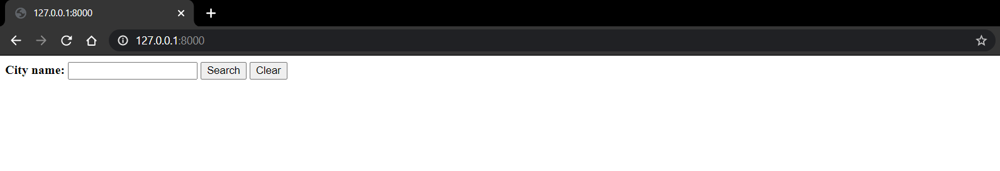
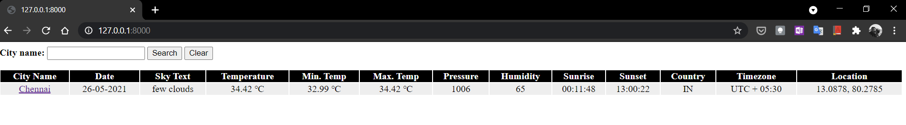
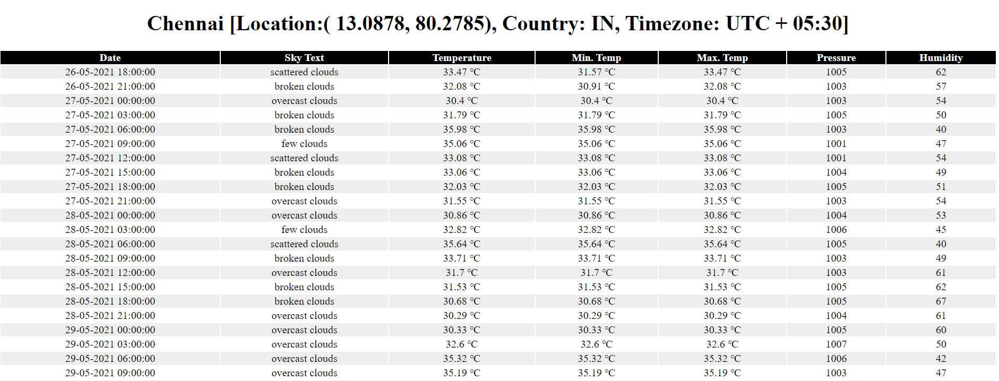

# Weather-Dashboard
Repository that Uses Django and Weather API to display the Weather Details.

**Commands:**  
 `django-admin startproject WeatherDashboard`  
 `python manage.py runserver`  
 `python manage.py startapp WeatherApi`  
 `python manage.py migrate`  
 `python manage.py makemigrations WeatherApi`  
 `python manage.py sqlmigrate WeatherApi 0001`  
 `python manage.py migrate`  
 `python manage.py createsuperuser`  

Till git revision `3f6232b7fdca1de68e27628ad377f905dae906dc`
The application uses [**python_weather**](https://pypi.org/project/python-weather/) python package to retrive the Weather.

After git revision `87cfaf7f334595cd9af972156fa873cac7b242ca`
The application uses [**Open Weather API**](https://openweathermap.org/api)

First Page:

On Search of City:

On clicking the city hyperlink, forecast info will be available:
